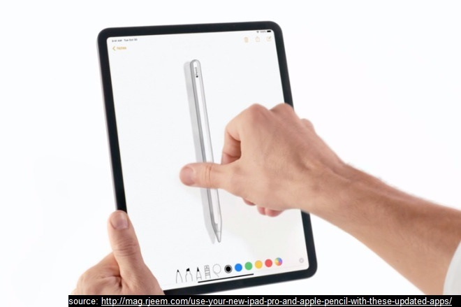
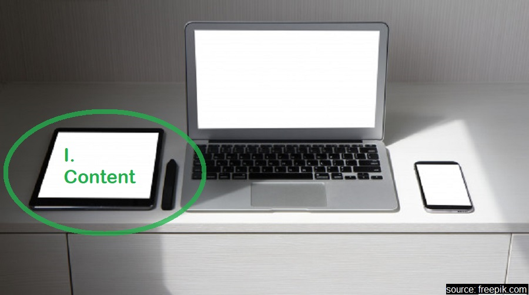
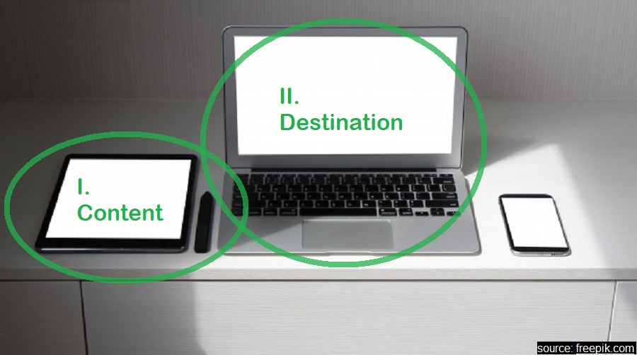
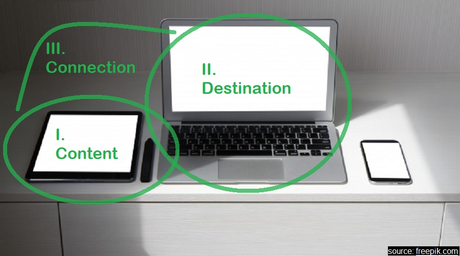

class: animated, fadeIn
##Outline

###I Technical solutions
 - equipment
 - soft
 - resources

</br>

###II Tips & tricks
 - preparing material
 - engaging students
 - giving tasks

---
class: section, animated, fadeIn
##Technical solutions:
#Equipment

---
class: section, animated, rotateIn
</br>


---
class: section, animated, flipInX 
</br>


---
class: animated, fadeIn 
### Tablets & styli
##Apple iPad & Pencil

 - .pro[easy to setup and use]
 - .con[very expensive]

--

##Alternative: tablet/smarphone & a universal stylus
 - .pro[as easy to use, almost as easy to setup, much cheaper]
 - .con[cheaper options are not that sensitive]
 
--

##Other options
 - graphical tablets, paper and camera, .cross[image editor and mouse]
 .pull-right[.rmk[share your ideas, please!]]

---
class: section, animated, fadeIn
##Technical solutions:
#Software

---
class: animated, fadeIn

</br>

.center_img[
```{r echo = FALSE}

```
]

--

.center_img[
```{r echo = FALSE}

```
]

--

.center_img[
```{r echo = FALSE}

```
]

--

.center_img[
```{r echo = FALSE}

```
]

---
class: animated, fadeIn
###Software
##I Content
 - thousands of solutions, starting from basic note-taking apps

--

##II Destination & III Connection
 - some conferencing solutions support tablet share (e.g. Zoom)
 - or, use mirroring software .rmk[runs on the tablet and the computer]
 

--

### Some alternatives
 - cloud and shared documents or working spaces
 - share the window of a text processor and type

---
class: section, animated, flipInY
#Resources

---
class: animated, fadeIn
##Choosing styli 
 - [Android compatible and universal styli](https://www.androidcentral.com/best-stylus-android-phones-and-tablets) .right[.rmk[[The most basic option](https://www.amazon.co.uk/Mixoo-Universal-Capacitive-Tablets-Smartphones/dp/B087J92RXF/ref=sr_1_7?dchild=1&keywords=stylus+for+touchscreen&qid=1595694533&sr=8-7)]]
 - [More expensive options](https://fixthephoto.com/best-stylus-for-tablets.html)

--

##Mirroring sofwtware
 - [A review of several options](https://blogs.systweak.com/screen-mirroring-apps/)
 - [Another review](https://www.apowersoft.com/best-screen-mirroring-app-2020.html) .right[.rmk[My personal best: [LonelyScreen](https://www.lonelyscreen.com/)]]

--

##Joint working spaces
 - [A review of whiteboard software](https://www.softwareadvice.com/whiteboard/)
 .right[.rmk[My choice is [ConceptBoard](https://conceptboard.com/)]]

---
class: section, animated, bounceIn
#Tips & Tricks
###on organizing material & engaging students

---
class: animated, fadeIn
###Tips & tricks
</br>
##I Prepare in advance
- **show it, rather than write** everything as the class goes on.

.pro[great for lectures, ] but .con[use with caution on exercise sessions]

---
class: animated, fadeIn
###Tips & tricks
</br>
##II Use chunks
 - break your material down into **logical pieces**,
 - show them **step-by-step**, and
 - focus on the **transitions**.

---
class: animated, fadeIn
###Tips & tricks
</br>
##III Omit some steps
.right[.rmk[great tool to engage your students!]]
 - stop *before* an important transition and ask **What's next?**
 - or, *after* a non-obvious step, ask **Why is it true?**
 - *make a mistake (or not)* and ask **Agree this is true? Why?**
 - *skip a step (or two)* and ask to help you **fill-in the gap**

---
class: animated, fadeIn
###Tips & tricks
</br>
##IV Save & use the progress

 - **don't erase** your board, **don't over-write** your work
 
 - find soft that allows you to **save, copy and paste**

--
 
 - you can **copy and go back** to ask great questions:
    - What happens, if I **change the initial values**?
    - Would **omitting an assumption** be crucial?
    - **Change the initial conditions to get a different outcome**

.right[.rmk[share your ideas]]

---
class: animated, fadeIn
###Tips & tricks
</br>
##V Use the same approach to giving tasks

Rather than requiring a complicated derivation or calculation, *check if your student can follow the derivation and understands important details*. **Give a (almost) complete result as part of the task**, and ask

 - true/false questions
 - to check the assumptions
 - listing the necessary theorems, etc
 - to change the intitial data for a particular result
 - filling-in gaps
 - finding mistakes

---
class: section, animated, flipInY
##Demonstration
###of Conceptbaord in action
</br>
.right[.rmk[I'll run an actual demonstration of how a prepared in advance material can be shared via Conceptboard. Hopefully, it'll take no more than 5 minutes.]]

---
class: section, animated, bounceIn
##Wrap-up
</br>
.rmk[not sure this is necessary for such a short session... but will do anyways, at least so that it is here, on the slides]

---
class: section, animated, zoomIn
##Best of luck in your teaching!
</br>
###.right[Thank you!]


