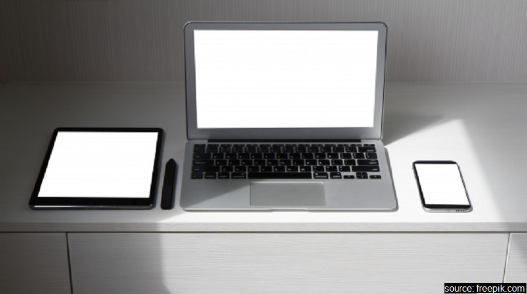

class: animated, fadeIn
##Outline

###I Technical solutions
 - equipment
 - soft
 - resources

</br>

###II Tips & tricks
 - preparing material
 - engaging students
 - giving tasks

---
class: section, animated, fadeIn
##Technical solutions:
#Equipment

---
class: section, animated, rotateIn
</br>


---
class: section, animated, flipInX 
</br>


---
class: animated, fadeIn 
### Tablets & styli
##Apple iPad & Pencil

 - .pro[easy to setup and use]
 - .con[very expensive]

--

##Alternative: tablet/smarphone & a universal stylus
 - .pro[as easy to use, almost as easy to setup, much cheaper]
 - .con[cheaper options are not that sensitive]
 
--

##Other options
 - graphical tablets, paper and camera, .cross[image editor and mouse]
 .pull-right[.rmk[share your ideas, please!]]

---
class: section, animated, fadeIn
##Technical solutions:
#Software

---
class: animated, fadeIn

</br>

.center_img[
```{r echo = FALSE}

```
]

--

.center_img[
```{r echo = FALSE}

```
]

--

.center_img[
```{r echo = FALSE}
knitr::include_graphics("stuff/soft2.jpg")
```
]

--

.center_img[
```{r echo = FALSE}

```
]

---
class: animated, fadeIn
###Software
##I Content
 - thousands of solutions, starting from basic note-taking apps

--

##II Destination & III Connection
 - some conferencing solutions support tablet share (e.g. Zoom)
 - or, use mirroring software .rmk[runs on the tablet and the computer]
 

--

### Some alternatives
 - cloud and shared documents or working spaces
 - share the window of a text processor and type

---
class: section, animated, flipInY
#Resources

---
class: animated, fadeIn
##Choosing styli 
 - [Android compatible and universal styli](https://www.androidcentral.com/best-stylus-android-phones-and-tablets) .right[.rmk[[The most basic option](https://www.amazon.co.uk/Mixoo-Universal-Capacitive-Tablets-Smartphones/dp/B087J92RXF/ref=sr_1_7?dchild=1&keywords=stylus+for+touchscreen&qid=1595694533&sr=8-7)]]
 - [More expensive options](https://fixthephoto.com/best-stylus-for-tablets.html)

--

##Mirroring sofwtware
 - [A review of several options](https://blogs.systweak.com/screen-mirroring-apps/)
 - [Another review](https://www.apowersoft.com/best-screen-mirroring-app-2020.html) .right[.rmk[My personal best: [LonelyScreen](https://www.lonelyscreen.com/)]]

--

##Joint working spaces
 - [A review of whiteboard software](https://www.softwareadvice.com/whiteboard/)
 .right[.rmk[My choice is [ConceptBoard](https://conceptboard.com/)]]


---
class: section, animated, bounceIn
#Thank you!


